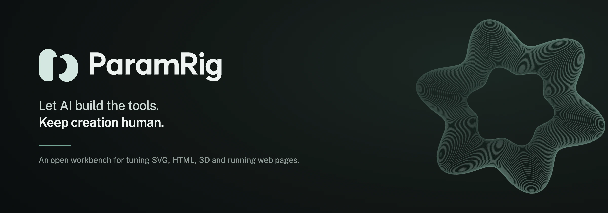
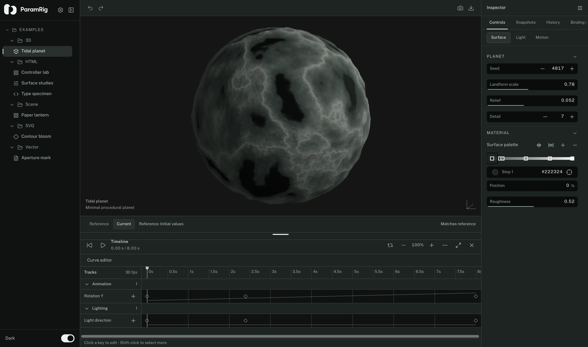
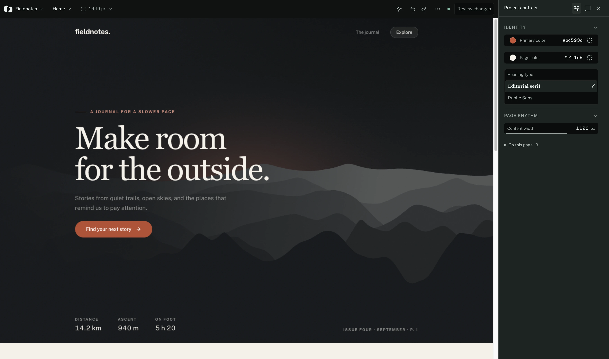
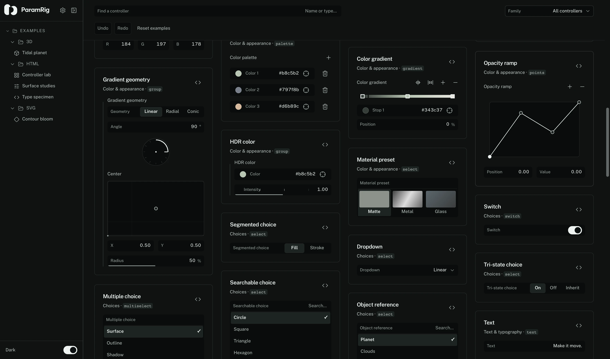
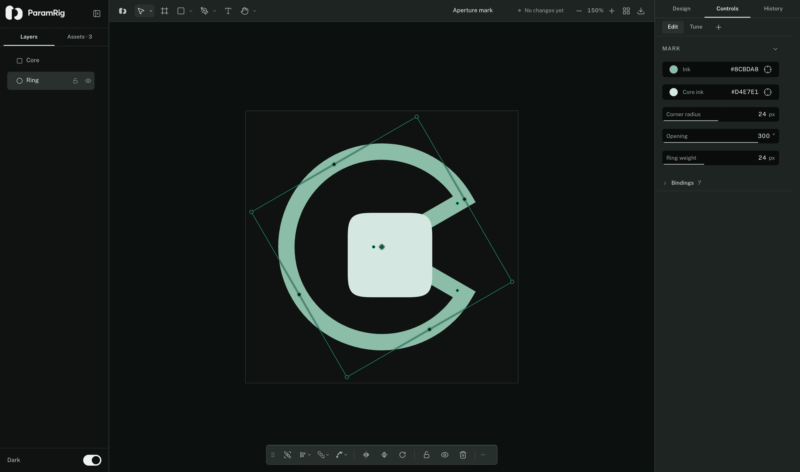
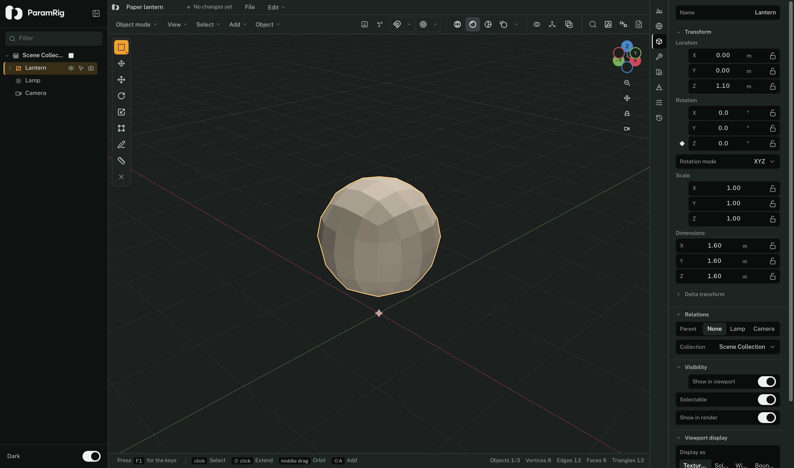
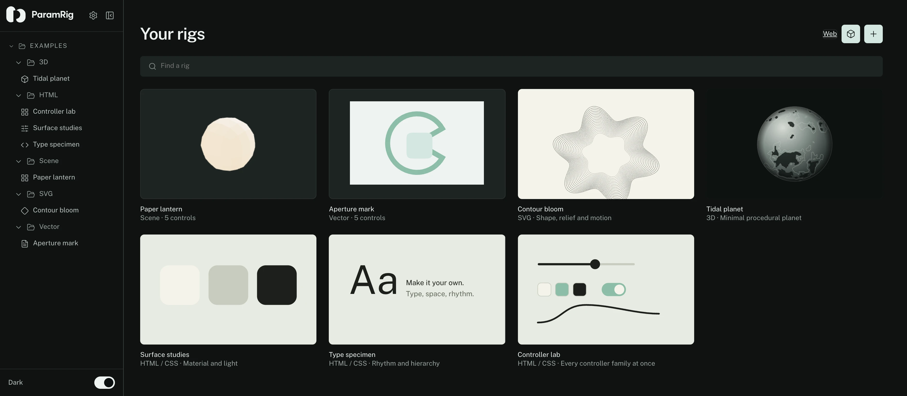

<p align="center">
  
</p>

<p align="center">
  <a href="https://www.npmjs.com/package/@paramrig/web"></a>
  <a href="https://github.com/Anymfah/paramrig/actions/workflows/verify.yml"></a>
  <a href="LICENSE"></a>
  
  <a href="https://paramrig.com"></a>
</p>

ParamRig is an open-source workbench for human-tuning AI-built visual systems.

Coding agents are good at building something that renders. The last mile is where they slow down.
A value is right or wrong because of how it looks, and turning that into prose costs several rounds
and rarely lands on it. So instead of asking AI to own the finished creative result, ParamRig asks
it to build the **tool**: a rig around a component, a design system, an SVG, an animation, a 3D
scene or a running page. You take the controls, find the values with your eyes, and hand back
numbers the agent can apply.

Uncertain ideas work the same way. A rough prototype becomes something you can manipulate, and the
parameters you approve go into the product.

It is for creative developers, vibecoders and technical artists who build visual systems with
coding agents, and lose time turning what they can see into precise code changes.

## How it works

**1. The agent builds the rig.** It names the parameters that matter, with their ranges and their
kinds: numbers, colors, curves, choices, resources, collections. In this repository that is a rig
manifest. In a project you are building it is `.paramrig/manifest.json` and the
[`@paramrig/web`](https://www.npmjs.com/package/@paramrig/web) SDK.

**2. You tune it.** The controls open beside a live preview. Compare against a reference, keep
snapshots, animate a value on the timeline, and step back through the session's history.

**3. The agent reads what you kept.** An export from the workbench, or a reviewed batch written into
the connected project for its own agent to pick up on the next run.

<p align="center">
  
  <br><sub>A rig open in the workbench: preview, inspector, and a timeline with grouped tracks and keyframes.</sub>
</p>

## Run it

The workbench runs as the Docker Compose project `paramrig`, from the repository root. Nothing
needs a Node installation on the host.

```bash
docker compose up -d
```

Open **http://localhost:5174/**. [`docs/local-docker-development.md`](docs/local-docker-development.md)
covers stop and start, rebuilds, and one-off commands.

```bash
docker compose run --rm app npm test
docker compose run --rm app npm run lint
docker compose run --rm app npm run build
```

| Route | What is there |
| --- | --- |
| `/` | The library |
| `/r/contour-bloom`, `/r/tidal-planet` | Example rigs |
| `/r/controller-lab` | Every controller family in one rig |
| `/docs` | Documentation inside the app |
| `/docs/controls` | The controller catalog |
| `/web` | Connected web projects |
| `/?fixture=empty`, `/?fixture=error`, `/?fixture=loading`, `/?fixture=long` | Library states for QA |

## Tune a project you are building

The Web workspace opens a page from your own development server beside the controls its agent
exposed. You change values, select DOM elements, draw on what you see, and approve a batch. The
batch is written into the project, where the agent that maintains it can read the note, the element
it points at, and the values you settled on.

In the project you are tuning:

```bash
npm install --save-dev @paramrig/web
```

Then, from this repository, point the optional `web` profile at it:

```bash
PARAMRIG_PROJECT_DIR=/absolute/path/to/project docker compose --profile web up -d
```

Open `/web` and pick the project. Without `PARAMRIG_PROJECT_DIR`, the profile starts with the
bundled Fieldnotes example instead.

<p align="center">
  
  <br><sub>A running page beside the controls its own agent exposed.</sub>
</p>

The service only writes inside the project's `.paramrig` directory. It does not start the
application, install anything in it, or touch its source. [`docs/web-workspace.md`](docs/web-workspace.md)
covers the setup and the file handoff. [`packages/web-sdk/README.md`](packages/web-sdk/README.md)
is the integration guide, with the manifest fields, the binding kinds, the `data-paramrig-*`
attributes and JSON Schema for the manifest, the batch and the response.

## Inside the workbench

### 66 controllers, 11 families

One value contract, several instruments. A number can be a field, a stepper, a bar, a logarithmic
scale, a stepped scale, a knob, an angle dial or a seed. The same definitions drive the catalog at
`/docs/controls`, the inspector, the vector and scene editors, and the Controller lab.

<p align="center">
  
</p>

Numbers, position and dimensions, color and appearance, choices, text and typography, curves and
profiles, resources, scene instruments, actions, collections, value sources and animation.
[`docs/CONTROLLERS.md`](docs/CONTROLLERS.md) has the contracts and the limits.

### Three editors that carry their own controls

A document can be a drawing, or a drawing that carries a rig. Bind an element's property to a
parameter and the document becomes tunable without leaving it. The same is true of a 3D scene and
of a sound.

| Vector documents | 3D scenes |
| --- | --- |
|  |  |
| Paths, networks and planar regions, text, frames, guides, boolean operations, export presets. Fills, strokes, effects and node positions can all be bound to a controller. | Objects, modifiers, lights, cameras, materials and world settings, with the same binding vocabulary. Edit and Tune share one WebGL context. |

**Sound effects.** Four layers — two oscillators, two noise generators — each with wavetables or
plain shapes, a filter of eight models, three insert slots and an amplifier envelope; eight
modulation slots that are each an envelope or an oscillator; three performers with a drawn row of
sixteen steps; three master effects. The engine is a pure function of a patch and a sample rate,
with no Web Audio in it, so what you hear while tuning and what lands in the exported file cannot
drift apart. [`/docs/audio-rigs`](https://app.paramrig.com/docs/audio-rigs) has the paths a control
can be bound to.

### Timeline, snapshots, history

Grouped tracks with zoom, keyframe selection and dragging, copy, paste and delete, precise time,
value and easing controls, and a playback range. A whole drag records as one action. The History tab
keeps the last 100 actions of the session. Snapshots can be named, restored with their reference,
and removed, and those actions undo too. Reference and Current sample animated values at the same
playhead position.

Right-click a control to reset it or animate it. Shift+F10 opens the same menu from the keyboard,
and small screens get an actions button. Keys, track labels, backgrounds, group headers and the
ruler have context menus of their own.

## Examples

<p align="center">
  
</p>

| Example | Renderer | What it shows |
| --- | --- | --- |
| Contour bloom | SVG | Shape, relief and motion from a handful of numbers |
| Tidal planet | 3D | A procedural planet, with two animated tracks |
| Surface studies | HTML / CSS | Material and light |
| Type specimen | HTML / CSS | Rhythm and hierarchy |
| Controller lab | HTML / CSS | Every controller family at once |
| Desk study | Scene | A lamp and two props, arranged, with six controls |
| Paper lantern | Scene | A 3D document that carries its own rig |
| Aperture mark | Vector | A drawing that carries its own rig |
| Aperture poster | Vector | A poster laid out with guides, bound to eight controls |

Examples come from [`src/rigs/registry.ts`](src/rigs/registry.ts).
[`docs/ADDING-A-RIG.md`](docs/ADDING-A-RIG.md) shows how to add a study without editing the
workspace shell.

## Documentation

| Document | What it covers |
| --- | --- |
| [`docs/local-docker-development.md`](docs/local-docker-development.md) | Commands, routes, rebuilds |
| [`docs/CONTROLLERS.md`](docs/CONTROLLERS.md) | Controller contracts and limits |
| [`docs/ADDING-A-RIG.md`](docs/ADDING-A-RIG.md) | Adding a rig |
| [`docs/web-workspace.md`](docs/web-workspace.md) | The connected web workspace |
| [`packages/web-sdk/README.md`](packages/web-sdk/README.md) | The `@paramrig/web` integration guide |
| [`docs/scene-editor-keymap.md`](docs/scene-editor-keymap.md) | Scene editor keys |

## What it does not do yet

Examples are bundled, and the workbench does not watch a folder on disk. An export is a file the
agent reads, not a patch applied to your source. Undo reaches back a hundred actions and no
further. Drafts and snapshots live in browser storage, and selection, track visibility and the
keyframe clipboard are gone after a reload. There is no account, no AI chat and no telemetry.

## Contributing

[`CONTRIBUTING.md`](CONTRIBUTING.md) has the checks to run and how a pull request lands.
[`AGENTS.md`](AGENTS.md) has the repository conventions, including the rule against AI signatures in
commit messages. English is the canonical language for the application, APIs, rig definitions,
documentation and error messages, and translations derive from that source. To report a
vulnerability, see [`SECURITY.md`](SECURITY.md).

The approved Coform logo and the branding study are in [`assets/brand/`](assets/brand/). The
application self-hosts Public Sans from `public/fonts/`, and the wordmark is vector geometry rather
than a font.

## Licensing

ParamRig is MIT licensed. The terms are in [`LICENSE`](LICENSE), and both `package.json` files
declare it. `packages/web-sdk` carries its own copy so the published package travels with it.

That covers ParamRig's own code. Runtime dependencies keep their own licences, listed in
`package.json`, and the bundled Public Sans keeps the SIL Open Font License that ships beside it in
`public/fonts/PublicSans-OFL.txt`.
